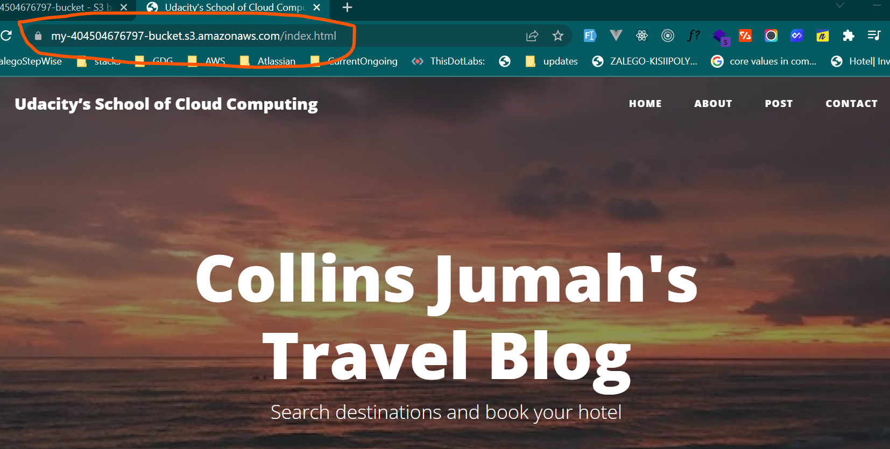

# Project1:  Deploying Static Website on AWSn S3 & configuring CloudFront Distribution.

This is a guided project for deploying a static website to AWS using S3, CloudFront, and IAM.

## STEP GUIDE AND SCREENSHOTS

### Step 1: Creating S3 bucket in AWS Management console
Created an S3 bucket in the Management console. 

### Step 2: Added Project starter files and folders
These files are refered to as Objects once uploaded in S3 bucket. 

### Step 3: Securitng Bucket via IAM, by adding policie to make bucket public
Since

The policy grant all access(public) to the S3 bucket resource in our case: <strong> <em>my-404504676797-bucket .</em> </strong>
 
As shown below the permission now changed to  <strong style="color: #ff0000">Public access</strong>

### Step 4: Configuring Static Web Hosting
By Default Static web hosting is disable, we need to configure and enable it by providing the 

  
After the configuration we obtain the bucket website endpoint:
<a href=" http://my-404504676797-bucket.s3-website-us-east-1.amazonaws.com" target="_blank"> http://my-404504676797-bucket.s3-website-us-east-1.amazonaws.com</a>

## Step 5: CloudFront
### a. Creating a CloudFront Distribution by specifying the Origin domain as the bucket website endpoint generated earlier. 

Below is the Distribution created and the domain name associated

### c. Final output when accessing the domain name Using CloudFront distribution domain name:

Link to the domain: <a href="https://d3ubysswx4j3bn.cloudfront.net/" target="_blank" >https://d3ubysswx4j3bn.cloudfront.net/</a>
 

### d. Accessing the Website using Website endpoint generated:
Below is the endpoint: <a href="http://my-404504676797-bucket.s3-website-us-east-1.amazonaws.com/" target="_blank">http://my-404504676797-bucket.s3-website-us-east-1.amazonaws.com/</a>

### e. Website Access using the S3 Bucket object URL
Link to the Website: <a href="https://my-404504676797-bucket.s3.amazonaws.com/index.html">https://my-404504676797-bucket.s3.amazonaws.com/index.html </a>

Output:

## Thank You
# 
END
 
